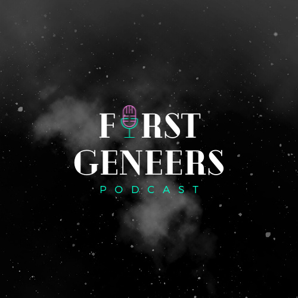

# First-Geneers Podcast Site

The official site for First-Geneers
<!-- TODO: Add logo to readMe -->

Link: * * * pending * * *

## How it's made

Tech used: HTML, CSS, JavaScript, Node.js

The page uses vanilla JavaScript, HTML5, and CSS in a Bootstrap fashion. The page is responsive and built using a "desktop-first" approach. This project gave us the opportunity to bring our audience a centralized place to connect with us all while learning more about front-end frameworks.

_**Server**_ - This will connect to the back end and listen actively
_**Views**_ - Views are made to be responsive.
_**Model**_ - The model is in progress
_**Controllers**_ - There is 1 controller

## Optimizations 
The ability to auto deploy this site upon any changes to the main branch (production branch) ---

## Lessons learned

We are learning how to build a professional site and collaborate on a medium-sized project

## Version control 

There have been a few times we had to back track to figure out what went wrong. From `git checkout <branch-name>` to `git log` and `git checkout -b <new-branch-name>` to figuring out how to reconcile merge conflicts, we became more familiar with using a variety of git commands.

## Debugging

On several occasions, some sections of our codebase were not doing what we originally intended. We got practice in going through our own code as a team and find a resolution to the issue.

## Styling

We are focusing on some front-end methods like flex and grid with CSS. 

## User interface design

We are learning how to make UI models with consideration for creative input. 
